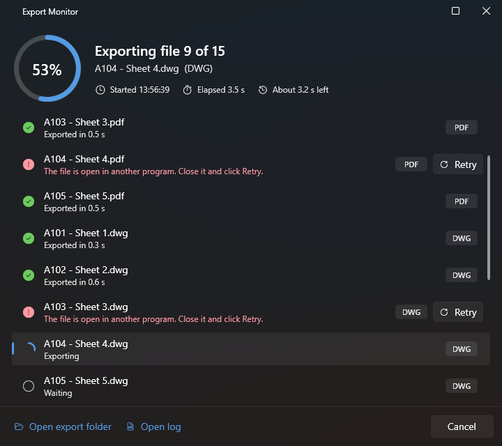

<p align="center">
  
</p>

<p align="center">
  <a href="https://github.com/sumer-alhussein/Osmus-download/releases/latest"><b>Download the latest release</b></a> ·
  <a href="#installation">Installation</a> ·
  <a href="#tools">Tools</a> ·
  <a href="#changelog">Changelog</a> ·
  <a href="#contributors">Contributors</a> ·
  <a href="https://github.com/sumer-alhussein/Osmus-download/issues">Report an issue</a>
</p>

# About Osmus

**Osmus** is a free add-in for **Autodesk Revit 2023, 2024, 2025 and 2026** that adds an *Osmus* ribbon tab with
productivity tools for BIM managers, architects and engineers:

- **Sheet composition & revisions** — create and rename sheets from Excel, apply revisions in bulk, build sheet sets
  by revision, write sheet scales into a parameter.
- **Selection helpers** — pick only walls or rooms, grab hidden elements or title blocks, drop grouped elements from a selection.
- **Model tools** — batch find/replace in model text, re-center rooms, create stair paths for whole floor plans, create standard worksets.
- **Cleanup** — purge unused view templates and filters, unplaced rooms and imported patterns.
- **Session helpers** — colour view tabs per document, switch the UI theme, and a *Warden* that double-checks risky commands.
- **Exports Manager** — batch export sheets and views to **PDF, DWG and DWF/DWFx** with saved profiles and custom file naming rules,
  and an export monitor to follow every file, cancel, and retry the ones that failed.

Osmus is developed by Sumer Alhussein. Contact: **sumer.alhussein@gmail.com**

# Installation

## Requirements
- Windows 10/11, 64-bit
- Autodesk Revit 2023, 2024, 2025 or 2026

## Install
1. Download an installer from the [releases page](https://github.com/sumer-alhussein/Osmus-download/releases/latest):

   | File | Installs for | Location |
   |---|---|---|
   | `Osmus-<version>-SingleUser.msi` | You only — no administrator rights needed | `%AppData%\Autodesk\Revit\Addins\<year>` |
   | `Osmus-<version>-MultiUser.msi` | Every user of the computer — needs administrator rights | `C:\ProgramData\Autodesk\Revit\Addins\<year>` |

2. **Close Revit**, run the installer and tick the Revit versions you use. It takes a few seconds.
3. Start Revit: the **Osmus** tab appears in the ribbon. If Revit asks whether to load the add-in, choose *Always Load*.

A newer version installs over the previous one — no need to uninstall first. Both installers are unsigned, so
Windows SmartScreen may show *"Windows protected your PC"*: click **More info → Run anyway**.

<details>
<summary>Alternative: Autodesk bundle</summary>

`Osmus.bundle.zip` is the Autodesk application bundle. Extract it so that the files end up in
`C:\ProgramData\Autodesk\ApplicationPlugins\Osmus.bundle\` (the `PackageContents.xml` must be directly inside
`Osmus.bundle`). Revit loads the version matching each release automatically.
</details>

<details>
<summary>Silent install (IT deployment)</summary>

```bat
msiexec /i Osmus-1.5.0-MultiUser.msi /qn
```
Installs every Revit version silently (log with `/l*v osmus-install.log`).
</details>

## Uninstall
Windows **Settings → Apps → Installed apps → Osmus → Uninstall**, with Revit closed. The add-in files are removed
from the Revit add-ins folder; your export profiles (`Documents\OsmusExportProfiles`) and settings
(`%AppData%\Osmus`) are kept and can be deleted by hand.

# Tools

The tools are grouped the way they appear in the ribbon.

## Osmus
| | Tool | What it does | How to use |
|---|---|---|---|
|  | **About** | Shows the installed version, the Revit version and links to this page, the releases, documentation, license and contact. | Click *About*. |

## Sheet Composition
| | Tool | What it does | How to use |
|---|---|---|---|
|  | **Sheets to Excel** | Saves the Excel template used to create or rename sheets (`Number`, `Name` columns). | Click, choose a folder → `Import sheets.xlsx` is created. **Shift + click** fills it with the sheets already in the model, so you can rename them. |
|  | **Create/ Update Sheets** | Creates the sheets listed in the template; sheet numbers that already exist get the name from the template instead. | Fill the template, click, pick the file, then pick the title block type for the new sheets. |
|  | **Bulk Revision** | Adds one revision to many sheets at once (sheets that already carry it are skipped). | Click, choose the revision, tick the sheets, *Finish*. **Shift + click** removes the revision from the ticked sheets instead. |
|  | **Sheet Set by Revision** | Creates a sheet set (for printing/exporting) holding every sheet that carries the chosen revision. | Click, choose the revision. An existing set with that name is deleted and re-created. |
|  | **Sheet Scale Parameter** | Copies each sheet's *Scale* (e.g. `1 : 100`) into a text parameter, so it can be scheduled or shown in title blocks. | Create a text parameter bound to *Sheets* (project or shared) first. Click, tick the sheets, choose the parameter, *Finish*. |

## Selection
| | Tool | What it does | How to use |
|---|---|---|---|
|  | **Pick Walls** | A selection mode that only accepts walls. | Click, then click or window-select in the view; only walls are picked. Press *Finish* (or Esc) when done. |
|  | **Pick Rooms** | A selection mode that only accepts rooms. | Same as *Pick Walls*, for rooms. |
|  | **Get Hidden Elements** | Turns on *Reveal Hidden Elements* and selects everything hidden in the active view. | Open the view, click. Review the selection, then unhide or leave as is. |
|  | **Get Sheet Title Blocks** | Selects the title blocks of the selected sheets (for editing their parameters in one go). | Select sheets in the Project Browser, click. |
|  | **Remove Grouped Elements** | Removes grouped elements and groups from the current selection, leaving the loose elements. | Make a selection, click. |

## Model
| | Tool | What it does | How to use |
|---|---|---|---|
|  | **Edit Text** | Find and replace text in model text elements, optionally adding a prefix and a suffix. | Select model text (or click first and pick it), then fill in *Find*, *Replace with*, *Prefix*, *Suffix* and tick *Match case* if needed. |

## Rooms
| | Tool | What it does | How to use |
|---|---|---|---|
|  | **Re-center Rooms** | Moves room locations (and their tags in the active view) to the centre of the room's bounding box. | Select the rooms, click. |

## Annotate
| | Tool | What it does | How to use |
|---|---|---|---|
|  | **Stair Path Pro** | Creates stair path annotations for every stair in the selected floor plans — including stairs from linked models if you want. | Click, choose the stair path type, tick *Include Linked Models* if needed, tick the plan views, *Finish*. |

## Collaboration
| | Tool | What it does | How to use |
|---|---|---|---|
|  | **Create Worksets** | Creates the office-standard worksets (AR Interior, AR Facade, AR Structure, AR FFE, AR Site, Z_Link …) that are missing from the model. | In a workshared model, click, tick the worksets to create. The tool offers to rename *Shared Levels and Grids* to *AR Grids and Levels*. |

## Cleanup
| | Tool | What it does | How to use |
|---|---|---|---|
|  | **Purge View Templates** | Lists the view templates not used by any view or view type. | Click, tick what to delete, *Finish*. |
|  | **Purge View Filters** | Lists the view filters not used by any view or view template. | Click, tick what to delete, *Finish*. |
|  | **Purge Unplaced Rooms** | Lists the rooms that are not placed in the model. | Click, tick what to delete, *Finish*. |
|  | **Delete Imported Patterns** | Deletes every fill and line pattern whose name starts with *Import* (left behind by CAD imports). | Click — there is no list; deletion is immediate (use *Undo* if needed). |

## Monitoring
| | Tool | What it does | How to use |
|---|---|---|---|
|  | **Warden** | Asks *"are you sure?"* before commands that often hurt model health: *Model In-Place*, *Import CAD* and *Paint*. | Click to turn it on or off; the state is remembered the next time Revit starts. |

## Windows
| | Tool | What it does | How to use |
|---|---|---|---|
|  | **Colored Tabs** | Colours the view tabs by document, so views of different models (and links) are easy to tell apart. Revit 2023 and 2024. | Click to turn it on or off; remembered between sessions. After turning it off, restart Revit to get the default tab colours back. |
|  | **Light / Dark mode** | Switches the Revit user interface between light and dark theme (Revit 2024 and later). | Click to switch. **Shift + click** also sets the drawing canvas to dark. |

## Export
| | Tool | What it does | How to use |
|---|---|---|---|
|  | **Schedule to Excel** | Exports the schedule shown in the active view to an Excel file. | Open a schedule view, click, choose a folder → `Export schedule.xlsx`. |
|  | **Exports Manager** | Exports sheets and views to **PDF**, **DWG** and **DWF/DWFx** in one go, with saved profiles, per-format options and custom file names. | See below. |

### Using the Exports Manager

1. **Profile** — pick a profile or *More → Save As* to create one. Everything in the window (formats, options,
   naming rules, save location, the list shown) is stored in the profile. With *Auto-save profile on Export* ticked,
   the profile is saved every time you export.
2. **Save Location** — the folder that receives the files; each format goes into its own `PDF`, `DWG` or `DWF` sub-folder.
   Leave it empty to export to `Documents\Osmus\<project name>`.
3. **Select Model** — the host model or one of its loaded links.
4. **Sheets List / Sheets / Views** — show the sheets of a sheet list schedule, all sheets, or the exportable views
   (floor plans, ceiling plans, 3D). Everything is selected by default; use `Ctrl + A`, `Ctrl + click` and
   `Shift + click` to refine, or the search box to filter.
5. **Custom file name** — click the pencil next to the *file name* box to build the naming rule from sheet/view
   parameters, project information and date/user values, each with a prefix, suffix and separator. Sheets and views
   have separate rules; the defaults are `<Sheet Number> - <Sheet Name>` and `<View Name>`.
6. **Export PDF / DWF / DWG** — switch each format on or off and open its options (paper, zoom, colours, raster
   quality, *Combine into a single file*, DWG export setup, xrefs…).
7. **Export** — opens the **export monitor**, which exports the files one by one and shows each of them with its
   format and status, a progress ring with the percentage, the start time, the elapsed time and an estimate of the
   time left. A file that could not be written (for example a PDF that is still open in a viewer) is marked as
   failed with the reason: close the file and click **Retry** on that row, or **Retry failed** for all of them.
   **Cancel** stops after the current file; **Resume** picks up the remaining ones. **Open export folder** opens
   the destination and **Open log** the log of the run (`%TEMP%\Osmus\Logs`), handy when reporting a problem.

<p align="center">
  
</p>

# Changelog

## 1.5.0

**Exports Manager**
- Export monitor: the *Export Complete* dialog is replaced by a window that follows the export file by file, with a
  progress ring and percentage, the start time, the elapsed and the estimated remaining time. You can cancel the run,
  see why a file failed and retry it (or all failed files), and open the export folder or the log from there.
- A file that is open in another program (for example the previous PDF in a viewer) was reported as exported although
  nothing was written; it is now reported as failed with the reason, and can be retried after closing it.
- Sheet or view names with characters Windows does not allow in file names no longer fail the PDF and DWG exports.
- Every export is logged to `%TEMP%\Osmus\Logs` (add-in and Revit versions, project, settings, one line per file with
  its duration or error).

## 1.4.0

**New**
- Osmus logo in the installer and the About dialog.
- About dialog with the add-in version, the Revit version and links to this page, releases, documentation, license, issues and contact.
- *Sheet Scale Parameter* (Sheet Composition): copies each selected sheet's Scale into a text parameter bound to sheets.
- Exports Manager: separate file name rules for sheets and views (defaults `<Sheet Number> - <Sheet Name>` and
  `<View Name>`), everything selected by default with keyboard/mouse hints, parameters added by double-click in the
  *Custom File Name* dialog.
- Colored Tabs is a one-click toggle; Colored Tabs, Warden and the last export profile are remembered between sessions.

**Fixes**
- Exports Manager: the *Export PDF* switch was not saved in the profile and came back on after a restart. Profiles now
  also remember the list shown (Sheets List / Sheets / Views) and the selected sheet list.
- Exports Manager: saving naming rules in Revit 2024 failed with *"Enum underlying type and the object must be same type"* and left the template empty.
- Faster rule editing (file names are no longer regenerated on every keystroke); separators are saved; DWF options fixed.

**Installer**
- New MSI installers (single-user and all-users) that follow the Autodesk add-in folder conventions, with one
  feature per Revit version (2023–2026), plus the `Osmus.bundle.zip` Autodesk bundle. Existing *Osmus Kit for
  Revit 2024* installations are upgraded in place.

## 25.05.01
- Support for Revit 2023, 2025 and 2026 alongside 2024.

## 25.04.01
- First public release of Osmus.

# Contributors

| Release | Contributors |
|---|---|
| 1.5.0 | Sumer Alhussein |
| 1.4.0 | Sumer Alhussein |
| 25.05.01 | Sumer Alhussein |
| 25.04.01 | Sumer Alhussein, Ghanem Ghanem, Mahmoud Al-Bzour |

Osmus started from the [geeWiz](https://github.com/aussieBIMguru/geeWiz) add-in template by Gavin Crump (MIT).

# License and support

Osmus is provided under the [end user license agreement](LICENSE.txt). It is an independent add-in and is not
affiliated with or endorsed by Autodesk, Inc.

Questions, bugs and ideas: [open an issue](https://github.com/sumer-alhussein/Osmus-download/issues) or write to
**sumer.alhussein@gmail.com**.
